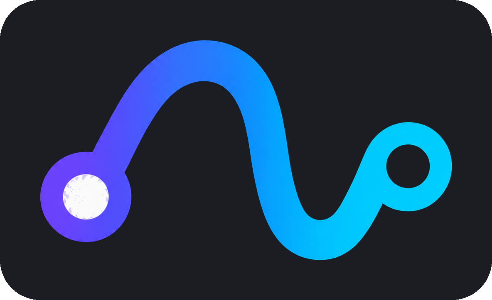
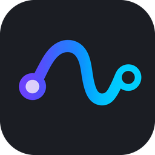
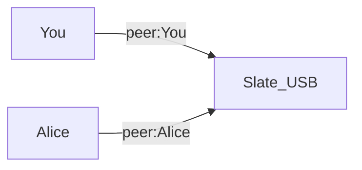

<p align="center">
  
</p>

<p align="center">
  Play and mix together over the internet or a LAN.<br>
  Pick a group name, join, and you’re connected.
</p>

<p align="center">
  <a href="https://github.com/FlybarBird/Netlay/releases/tag/v1.1.0"></a>
  <a href="LICENSE"></a>
  
  
  
</p>

**Netlay** is a slim, standalone network-audio app. It is a focused fork of [SonoBus](https://github.com/sonosaurus/sonobus): the same peer-to-peer Opus/PCM path, rebuilt around a simpler session UI and **remote mix control**.

<p align="center">
  
</p>

## Download

Latest build: **[v1.1.0](https://github.com/FlybarBird/Netlay/releases/tag/v1.1.0)**

| | |
|---|---|
| macOS (Apple Silicon + Intel) | [`Netlay-1.1.0-mac.zip`](https://github.com/FlybarBird/Netlay/releases/download/v1.1.0/Netlay-1.1.0-mac.zip) |
| Windows (x64) | [`Netlay-1.1.0-win.zip`](https://github.com/FlybarBird/Netlay/releases/download/v1.1.0/Netlay-1.1.0-win.zip) |
| GL.iNet Slate 7 | [`netlay-glbe3600_1.0.1` IPK](https://github.com/FlybarBird/Netlay/releases/download/v1.1.0/netlay-glbe3600_1.0.1-1_aarch64_cortex-a53_neon-vfpv4.ipk) |

The macOS zip is not notarized yet. First launch: right-click the app → **Open**.

## What’s inside

One window, five pages:

| Page | |
|------|--|
| **Network** | Join or create a group |
| **Peers** | Who’s in the session, local send/recv |
| **Group Control** | Mix what someone else hears |
| **Soundboard** | Trigger clips into the session |
| **Settings** | Devices, input groups, allow remote mix |

Standalone only — no VST/AU/LV2 in this fork. Chat, FX, reverb, recording, and metronome are off by default.

## Group Control

Group Control runs someone else’s listen mix while you play. Faders are **people who are transmitting** (you, and anyone sending audio). Listen-only boxes like the Slate stay mix *targets*, not strips.

1. Join the same group as the people you want to control.
2. Open **Group Control**.
3. **Main Mix** defaults to everyone connected. Or make a named group and pick members.
4. Move a fader — that source’s receive level (or mute) changes on the target, and their UI follows.

Transport is the existing `/sb` OSC path over UDP (sequence numbers, ACK/NACK, retries, snapshot reconcile). Targets can turn it off in **Settings → Allow others to control my mix** (on by default).



## GL.iNet Slate 7

A listen-only plugin for the **GL-BE3600**. USB speakers out, no mic send. Desktop Netlay can mix it from Group Control.

1. Download [`netlay-glbe3600_1.0.1` IPK](https://github.com/FlybarBird/Netlay/releases/download/v1.1.0/netlay-glbe3600_1.0.1-1_aarch64_cortex-a53_neon-vfpv4.ipk).
2. Open the router admin at [192.168.8.1](http://192.168.8.1) → **SYSTEM → Advanced Settings** → **LuCI**.
3. In LuCI: **System → Software → Upload Package…**, choose the IPK, then **Install**.
4. Back in the GL.iNet UI: **Applications → Netlay**. Same group name as the desktops. Leave **Allow remote mix** on.

Details: [openwrt/README.md](openwrt/README.md).

## Tips

- Headphones if you have a live mic — there is no echo cancellation.
- Wired ethernet beats Wi‑Fi for lowest latency.
- Audio is peer-to-peer. The connection server is only so people in a group can find each other. Data is not encrypted.

## Building (macOS)

CMake ≥ 3.15 and Xcode / Command Line Tools. Dependencies are vendored.

```bash
export PATH="/opt/homebrew/bin:$PATH"   # if needed on Apple Silicon
cmake -S . -B build
cmake --build build --config Release
```

App: `build/SonoBus_artefacts/Release/Standalone/Netlay.app`

Windows CI builds the standalone `.exe` from `.github/workflows/windows-standalone.yml`. Slate IPK: `./openwrt/scripts/build-mac-cross.sh` (needs Zig).

## Layout

| Path | Role |
|------|------|
| `Source/` | App UI and processor, including remote mix |
| `images/` | Icons, wordmark, mark |
| `deps/` | JUCE, AOO, meters, Opus |
| `openwrt/` | Slate 7 plugin |

Active development is on `simplify`.

## License

GPLv3 (`LICENSE`), with the App Store exception in `LICENSE_EXCEPTION` where applicable. Dependencies keep their own licenses.

SonoBus was written by Jesse Chappell. Netlay is based on that work.

- **SonoBus** — Jesse Chappell
- **AOO** — Christof Ressi
- **Soundboard** — Sten Wessel, Hannah Schellekens
- Built with JUCE and Opus

Upstream: [github.com/sonosaurus/sonobus](https://github.com/sonosaurus/sonobus)
